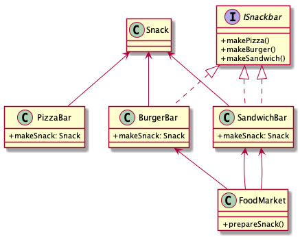

### MSD19 - SW Design 

## OODesign Principles - Excersice 

This repo contains a exercice for the SOLID principles

# Beispiel Refactor to SOLID

```FoodMarket``` hat verschiedene *Snackbars*, jede *Snackbar* hat als Ergebnis ein Objekt ```Snack```




**Problem** 
Analyse des Codes, stellen Sie fest wo die Prinzipien von SOLID verletzt werden und wie die SOLID Prinzipien besser angewendet werden können.

### Aufgaben 


#### 1. Analyse der Snack-Anwendung


**ISP**

wo findet man eine Verletzung dieses Prinzips, wie kann dies geändert werden?

**OCP**

wo findet man eine Verletzung dieses Prinzips, wie kann dies geändert werden?

**DIP**

wo findet man eine Verletzung dieses Prinzips, wie kann dies geändert werden?


**TODO**:

Wo befinden sich die genannten Schwachstellen?

Erstellen sie ein Dokument (pdf) mit der Beschreibung (welcher Codeteil, Screenshot, Begründung)    


    	
####  2. Refactor to SOLID

1. ISP - Wie geht man damit um, dass ...?
  
2. OCP - In den Klassen ..?
	
3. DIP - In der Klasse *FoodMarket* finden sich Instanzen der ...

Die Klasse *SnackBarMain* bleibt unverändert und die Ausgabe soll in etwa so aussehen

    This is a tasty Pizza
    This is a tasty Burger
    This is a tasty Sandwich 
    

**TODO**:

- Ändern Sie den Source-Code 
- Erstellen sie ein Dokument (pdf) mit der Beschreibung der Änderungen (welcher Codeteil, Screenshot, Begründung)    

